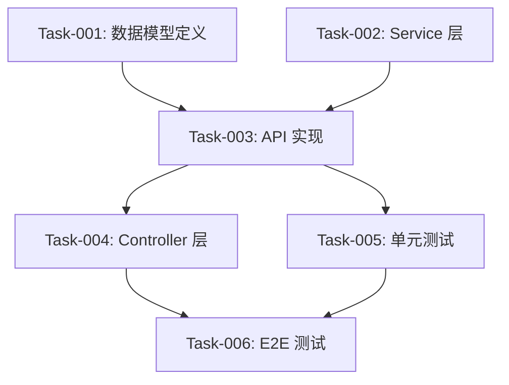

# ADR-004：设计文档到实施任务拆分技能（I2I — Design-to-Impl Skill）设计规范

> **SSOT ID**: ADR-004
> **Title**: 设计文档到实施任务拆分技能 — 输入校验 + 内容整合 + 最小可验收任务拆分 + 依赖关系定义
> **Status**: Draft
> **Version**: v1.4
> **Effective Date**: TBD
> **Scope**: 设计文档整合 / 实施任务拆分 / 依赖关系管理 / 实施文档生成
> **Owner**: 研发流程 / AI 实施
> **Governance Kind**: NEW
> **Audience**: AI 实施代理、Tech Lead、开发者
> **Depends On**: ADR-002 (Design Check Skill), ADR-003 (Code Patrol Skill), DOC-WRITING-GUIDE v1.0
> **Supersedes**: 无

---

## 1. 背景

### 1.1 One-Sentence Summary

> **设计文档（PRD / Architecture / API / UX / Tech / Test / Data Flow / DDD 等）通过校验后，缺乏从"设计意图"到"可执行任务"的自动化桥接——任务拆分完全依赖人工经验，导致拆分粒度不一致、上下文丢失、依赖关系遗漏、实施文档缺失关键背景。**

### 1.2 现有能力与缺口

| 工具 / 技能 | 能力 | 缺口 |
|------------|------|------|
| `zeng-design-check` | 设计文档 6 维度校验 | 仅校验质量，不产出实施计划 |
| `gsd-plan-phase` | 阶段规划 | 面向 GSD 工作流，不直接消费设计文档 |
| 人工拆分 | Tech Lead 经验驱动 | 粒度不一致，依赖关系靠记忆，上下文在传递中丢失 |

核心缺口：**校验通过的设计文档 → 可执行的实施任务之间没有自动化的桥接环节**。

### 1.3 核心洞察

设计文档是"做什么"和"为什么"的载体，实施任务是"怎么做"和"按什么顺序"的载体。两者之间需要一个**无损转化**过程：

1. **不补充新内容**：技能只做整合和拆分，不发明设计文档中没有的功能或技术方案
2. **最小可验收颗粒度**：每个 task 必须能独立交付并被验收
3. **上下文完整性**：每个 task 的实施文档包含该 task 需要的全部上下文，实施者无需回溯源文档
4. **依赖关系显式化**：task 之间的先后顺序和阻塞关系通过索引文档显式声明

### 1.4 与现有技能的关系

| 技能 | 关系 | 说明 |
|------|------|------|
| `zeng-design-check` | **上游** | Design Check 校验文档质量 → 通过后 I2I 接手整合与拆分 |
| `zeng-code-patrol` | **下游** | I2I 产出的实施任务完成后，Code Patrol 巡检代码质量 |
| `gsd-plan-phase` | 平行 | GSD 面向里程碑规划，I2I 面向设计文档到任务的转化 |
| `zeng-doc-quality-loop` | 无直接关系 | Doc Quality Loop 侧重文档可读性，I2I 侧重实施转化 |

---

## 2. 问题

### 2.1 设计文档到实施任务的转化损耗

| 损耗类型 | 表现 | 后果 |
|---------|------|------|
| **上下文丢失** | 实施者只拿到任务描述，丢失了设计意图和约束 | 实现偏离设计原意 |
| **粒度不一致** | 有的 task 是"实现用户注册"（太大），有的是"加一个字段"（太小） | 无法统一验收标准 |
| **依赖遗漏** | Task B 依赖 Task A 的产出物，但未声明 | 执行顺序错误，返工 |
| **跨文档信息碎片化** | 一个功能的行为分散在 PRD、UX Spec、Tech Design 中 | 实施者需要同时打开 3+ 个文档 |
| **Out of Scope 被意外纳入** | 设计文档明确排除的内容在实施时被做进去 | 范围膨胀 |

### 2.2 最小可验收颗粒度的定义难题

| 粒度 | 问题 |
|------|------|
| 太粗（整个 Feature） | 无法增量验收，风险后置 |
| 太细（单个函数） | 任务数量爆炸，管理成本高于价值 |
| 无验收标准 | 做完了但不知道算不算"完成" |

需要一个**可操作的颗粒度判定规则**，而非依赖人工判断。

---

## 3. 决策

### 3.1 总体决策

引入 **`zeng-i2i`** 技能（I2I — Design-to-Impl Skill），作为设计文档校验通过后的**实施转化引擎**。采用 **纯 LLM + 结构化输出** 架构（与 zeng-design-check 同架构模式）。

核心设计：

```text
┌─────────────────────────────────────────────────────────────────────┐
│              I2I — 设计文档 → 实施任务 转化引擎                        │
├─────────────────────────────────────────────────────────────────────┤
│                                                                     │
│  Phase 1: 输入校验（内嵌 Design Check Gate Rubric）                 │
│  ──────────────────────────────────────────                         │
│  1. 识别输入文档类型（15+ 种设计文档）                                │
│  2. 校验每个文档的必输要素是否齐全                                    │
│  3. BLOCK → 返回缺失清单，停止（不补充任何新内容）                     │
│  4. CONDITIONAL → 记录 WARN 项，带标注继续（不阻塞）                  │
│  5. PASS → 进入 Phase 2                                             │
│                                                                     │
│  Phase 2: 内容整合                                                  │
│  ──────────────────────────────────────────                         │
│  1. 按功能特性（Feature）聚合跨文档信息                               │
│  2. 每个 Feature 生成统一的上下文摘要                                 │
│  3. 标注 Out of Scope（不纳入实施）                                  │
│                                                                     │
│  Phase 3: 任务拆分                                                  │
│  ──────────────────────────────────────────                         │
│  1. 按最小可验收颗粒度拆分 Task                                       │
│  2. 每个 Task 定义验收标准（来自 AC/测试设计）                         │
│  3. 定义 Task 间依赖关系                                             │
│  4. 生成实施拓扑排序                                                 │
│                                                                     │
│  Phase 4: 文档生成                                                  │
│  ──────────────────────────────────────────                         │
│  1. 每个 Task → 独立 impl 文档（含完整上下文）                         │
│  2. 索引文档（依赖关系 + 执行顺序）                                   │
│  3. Feature 上下文文档                                               │
│  4. 汇总报告（统计数据 + 决策摘要）                                   │
│                                                                     │
│  输入: 设计文档路径（PRD/Arch/API/UX/Tech/Test/Data/DDD/...）       │
│  输出: impl-{feature}-{number}/ 目录                                 │
│                                                                     │
└─────────────────────────────────────────────────────────────────────┘
```

**核心原则**：

1. **只整合不补充**：从设计文档中提取和重组信息，不发明新内容
2. **最小可验收颗粒度**：Task 拆分必须满足验收标准定义规则（§3.4）
3. **上下文自包含**：每个 Task 的 impl 文档是独立可执行的，无需回溯源文档
4. **依赖关系显式化**：索引文档包含完整的 DAG（有向无环图）依赖关系
5. **DAG 确定性校验**：环检测和拓扑排序由确定性脚本执行，不依赖 LLM
6. **与 Design Check 衔接**：内嵌 Gate Rubric，三态判定（BLOCK/CONDITIONAL/PASS）

### 3.2 输入模型

#### 输入文档类型（15+ 种）

基于真实项目文档结构（参考 `ai-marathon-coach-v2/docs/mvp-lite/`），I2I 支持以下文档类型：

| 类型 ID | 文档类型 | 目录特征 | 文件名特征 | 提供的信息 |
|---------|---------|---------|-----------|-----------|
| **T01** | PRD | `prds/` | `PRD-*.md` | 用户故事、AC、业务规则、优先级、Out of Scope |
| **T02** | Architecture | `arch/` | `ARCH-*.md` | 技术选型、架构分层、模块边界、技术约束 |
| **T03** | API Design | `api/` | `API-*.md` | API 端点、请求/响应 Schema、错误码 |
| **T04** | Business Design | `business/` | `BUSINESS-*.md` | 商业模型、用户画像、业务价值、成功指标 |
| **T05** | Tech Design | `tech/` | `TECH-*.md` | 时序图、同步/异步策略、存储方案、实现细节 |
| **T06** | UX Spec | `ux/` | `UX-*.md` | 交互流程、设计原则、状态表达、文案风格 |
| **T07** | UX Prototype | `ux-prototypes/` | `*.md` | 设计系统、组件规范、交互原型描述 |
| **T08** | Test Design | `testset/` | `TESTSET-*.md` | 测试范围、Happy Path、边界条件、测试用例 |
| **T09** | Data Flow | `data/` | `DataFlow-*.md` | 数据流转、状态机、数据依赖关系 |
| **T10** | DDD | `ddd/` | `DDD-*.md` | 领域模型、聚合根、值对象、仓储契约 |
| **T11** | Skill Design | `skills/` | `SKILL-*.md` | AI Skill 定义、Prompt 设计、工具链 |
| **T12** | Adapter Design | `adapters/` | `ADAPTER-*.md` | 外部系统适配、数据转换、集成协议 |
| **T13** | Job Design | `jobs/` | `JOB-*.md` | 异步任务、定时任务、队列消费 |
| **T14** | Strategy | `stg/` | `*.md` | 战略规划、商业宪法、产品定位 |
| **T15** | Review | `reviews/` | `Review-*.md`, `Cross-Review-*.md` | 审查意见、跨维度对齐结论 |

#### 文档→信息提取映射

| 文档类型 | 提取什么 | 用于 Task 的哪个部分 |
|---------|---------|-------------------|
| T01 PRD | 用户故事、AC、业务规则、优先级、Out of Scope | Task 描述、验收标准、优先级、排除项 |
| T02 Architecture | 技术选型、分层、模块边界 | 技术约束、架构分层要求 |
| T03 API Design | 端点定义、Schema、错误码 | 接口契约、数据结构、异常处理 |
| T04 Business Design | 用户画像、业务价值、成功指标 | 需求背景、验收指标 |
| T05 Tech Design | 时序图、同步/异步、集成点、降级策略 | 实现细节、集成要求、异常处理 |
| T06 UX Spec | 交互流程、状态表达、文案、平台差异 | UI 实现要求、交互细节 |
| T07 UX Prototype | 设计系统、组件规范 | UI 组件要求、样式约束 |
| T08 Test Design | 测试用例、边界条件、Mock 需求 | 验收标准、测试验证点 |
| T09 Data Flow | 数据流转、状态机、数据依赖 | 数据模型约束、状态转换规则 |
| T10 DDD | 领域模型、聚合根、值对象 | 领域边界、数据模型设计 |
| T11 Skill Design | Skill 定义、Prompt、工具链 | AI 能力约束、Prompt 工程要求 |
| T12 Adapter Design | 外部系统适配、数据转换 | 集成层实现、数据映射 |
| T13 Job Design | 异步任务、定时任务、队列 | 后台任务实现、调度策略 |
| T14 Strategy | 战略规划、产品定位 | 需求优先级、产品方向约束 |
| T15 Review | 审查结论、对齐意见 | 跨文档一致性参考 |

#### 输入模式

| 模式 | 输入 | 可执行的转化 |
|------|------|------------|
| **最小输入** | PRD + Architecture | Feature 聚合 + Task 拆分（无 UX/Test 上下文） |
| **标准输入** | PRD + Architecture + API + Tech | 完整 Feature 聚合 + Task 拆分 + 技术上下文 |
| **全量输入** | 所有可用设计文档 | 全量上下文整合 + Task 拆分 + 验收标准 + 测试上下文 |
| **目录扫描** | `--dir docs/` | 自动发现所有文档，按文件名前缀识别类型 |

#### 文档状态要求

I2I 仅接受以下状态的文档作为输入：

| 状态 | 说明 | I2I 行为 |
|------|------|---------|
| **approved** | 文档已通过评审，内容已确认 | 接受，执行完成后将状态置为 `frozen` |
| **frozen** | 文档已锁定，不可修改 | 接受，保持 `frozen` 状态不变 |
| **draft** | 文档尚在编写中 | **拒绝**，BLOCK 并提示文档需先通过评审 |
| **reviewing** | 文档正在评审中 | **拒绝**，BLOCK 并提示文档需先通过评审 |

**文档状态识别规则**：

1. 检查文档 frontmatter 中的 `status` 字段（如 `status: approved`）
2. 检查文档头部的状态标记（如 `**Status**: approved` 或 `**状态**: 已批准`）
3. 检查文件名中的状态后缀（如 `PRD-M01.approved.md`、`PRD-M01.frozen.md`）
4. 以上均无 → 默认视为 `draft`，BLOCK

**执行后状态流转**：

I2I Phase 4 所有 Task 文档生成成功后，将所有输入文档的状态置为 `frozen`：

1. 更新文档 frontmatter 中的 `status: frozen`
2. 更新文档头部的状态标记
3. 在 SUMMARY.md 中记录状态变更日志

```
文档状态流转: draft → reviewing → approved → [I2I 执行] → frozen
```

#### 文档自动识别规则

```
识别优先级: 文件名前缀 > 目录路径 > 内容特征

1. 文件名前缀匹配（最高优先级）
   PRD-*     → T01  ARCH-*    → T02  API-*     → T03
   BUSINESS-*→ T04  TECH-*     → T05  UX-*      → T06
   TESTSET-* → T08  DataFlow-* → T09  DDD-*     → T10
   SKILL-*   → T11  ADAPTER-*  → T12  JOB-*     → T13

2. 目录路径匹配（次优先级）
   prds/      → T01  arch/      → T02  api/       → T03
   business/  → T04  tech/      → T05  ux/        → T06
   ux-prototypes/ → T07  testset/ → T08  data/    → T09
   ddd/       → T10  skills/    → T11  adapters/  → T12
   jobs/      → T13  stg/       → T14  reviews/   → T15

3. 内容特征匹配（兜底）
   含用户故事/AC          → T01  含架构分层/技术选型 → T02
   含 API 端点/Schema     → T03  含交互流程/设计原则 → T06
   含设计系统/组件规范     → T07  含测试范围/Happy Path  → T08
   含领域模型/聚合根      → T10  含数据流转/状态机  → T09
```

### 3.3 执行流程

```
阶段 1: 输入校验 [LLM]
    │
    ├── 读取输入文档路径
    ├── 自动识别文档类型（文件名前缀 → 目录 → 内容特征）
    ├── 检查文档状态（frontmatter status / 头部标记 / 文件名后缀）
    │   ├── draft / reviewing → BLOCK，提示文档需先通过评审
    │   ├── approved → 通过，标记待 frozen
    │   └── frozen → 通过，无需变更
    ├── 对每个文档执行质量校验：
    │   ├── 必输要素是否存在（复用 Design Check Gate G1）
    │   ├── 内容是否非空非占位符
    │   └── 结构是否完整
    │
    ├── 判定:
    │   ├── BLOCK（必输要素缺失）→ 输出缺失清单，停止（不补充任何新内容）
    │   ├── CONDITIONAL（有 WARN 但无 BLOCK）→ 记录 WARN 项，带标注进入阶段 2
    │   └── PASS → 进入阶段 2
    │
    ▼
阶段 2: 内容整合 [LLM]
    │
    ├── 按 Feature（功能特性）聚合跨文档信息
    │   ├── 从 T01 PRD 提取: 用户故事 + AC + 业务规则 + 优先级
    │   ├── 从 T02 Architecture 提取: 技术约束 + 模块边界
    │   ├── 从 T03 API Design 提取: 端点定义 + Schema + 错误码
    │   ├── 从 T05 Tech Design 提取: 时序 + 集成 + 降级
    │   ├── 从 T06 UX Spec 提取: 交互流程 + 状态 + 文案
    │   ├── 从 T08 Test Design 提取: 测试用例 + 边界条件
    │   ├── 从 T09 Data Flow 提取: 数据流转 + 状态机
    │   ├── 从 T10 DDD 提取: 领域模型 + 聚合边界
    │   └── 从 T11-T13 提取: Skill/Adapter/Job 相关约束
    │
    ├── 标注 Out of Scope（来自 PRD BD-4）→ 不纳入 Task
    │
    ├── 输出: feature-context.md（Feature 的聚合上下文）
    │
    ▼
阶段 3: 任务拆分 [LLM]
    │
    ├── 对每个 Feature:
    │   ├── 按最小可验收颗粒度拆分 Task（§3.4 规则）
    │   ├── 为每个 Task 定义验收标准（来自 AC + 测试设计）
    │   ├── 标注优先级（继承自 PRD 的 P0/P1/P2）
    │   └── 标注依赖关系（哪些 Task 必须先完成）
    │
    ├── 全局依赖分析 [LLM 产出 + 确定性校验]:
    │   ├── 跨 Feature 依赖（Feature B 依赖 Feature A 的产出）
    │   ├── LLM 产出依赖关系 → task-list.json
    │   └── 确定性校验脚本（validate-dag.py）:
    │       ├── 环检测（Tarjan 算法）
    │       ├── 拓扑排序（Kahn 算法）
    │       ├── 孤立节点检测（无依赖也无被依赖的 Task）
    │       └── 输出: dag-validation.json（PASS / CYCLE_DETECTED / WARNING）
    │
    ├── 输出: task-list.json（结构化任务清单 + 依赖关系）
    │
    ▼
阶段 4: 文档生成 [LLM]
    │
    ├── 为每个 Task 生成独立 impl 文档:
    │   ├── Task 描述（做什么）
    │   ├── 验收标准（怎么算完成）
    │   ├── 完整上下文（从各设计文档聚合的相关信息）
    │   ├── 技术约束（来自 Architecture/Tech Design）
    │   ├── 交互要求（来自 UX Spec/UX Prototype）
    │   ├── 领域模型（来自 DDD）+ 数据流（来自 Data Flow）
    │   ├── 测试要点（来自 Test Design）
    │   ├── 依赖项（前置 Task + 产出物）
    │   ├── 排除项（Out of Scope 中与本 Task 相关的部分）
    │   └── 实施指引（仅基于设计文档已明确信息，§4.2 边界定义）
    │
    ├── 生成索引文档 INDEX.md:
    │   ├── Task 列表（ID + 名称 + 状态 + 优先级）
    │   ├── 依赖关系图（DAG 可视化 + 表格为权威源）
    │   ├── 执行顺序（拓扑排序结果）
    │   └── 关键路径标注
    │
    ├── 生成汇总报告 SUMMARY.md:
    │   ├── 统计信息（Task 数量、依赖深度、预估工作量）
    │   ├── Feature → Task 映射
    │   ├── 输入文档引用 + 校验结果（含 CONDITIONAL 的 WARN 项）
    │   ├── Out of Scope 汇总
    │   ├── 关键决策记录
    │   └── 风险与注意事项
    │
    ├── 生成全局索引 IMPL-INDEX.md（多 Feature 时）:
    │   ├── Feature 清单 + 统计
    │   ├── 跨 Feature 依赖关系
    │   ├── 全局 DAG 可视化
    │   └── 全局执行顺序 + 关键路径
    │
    ▼
    阶段 4.5: 文档状态冻结 [LLM]
    │
    ├── Phase 4 文档生成全部成功后：
    │   ├── 将所有输入文档状态置为 frozen
    │   │   ├── 更新 frontmatter: status: frozen
    │   │   ├── 更新头部状态标记
    │   │   └── 注意：文件名中的状态后缀不做更新，frontmatter 为权威源
    │   └── 在 SUMMARY.md 中记录状态变更日志
    │
    ├── 如果 Phase 4 生成失败：
    │   └── 不冻结文档，保持原有状态，允许修复后重跑
    │
    ▼
    完成。产出 impl-{feature}-{PRD-ID}/ 目录 + IMPL-INDEX.md + 输入文档 frozen。
```

### 3.4 最小可验收颗粒度定义

Task 拆分必须满足以下**全部**条件：

| # | 条件 | 说明 |
|---|------|------|
| 1 | **可独立验收** | 完成后有明确的验收标准，无需等待其他 Task |
| 2 | **有明确产出物** | 产出可观察的代码/配置/文档变更 |
| 3 | **工作量可控** | 单个 Task 的预估工作量不超过 1 个开发者日（8h）。**例外**：当"不应拆分"规则适用时（强耦合无法独立验收），允许超过 8h，但必须在 Task 文档中记录例外理由 |
| 4 | **上下文完整** | 实施者只看本 Task 的 impl 文档即可开始工作 |
| 5 | **不跨层** | 不同时涉及前端 + 后端 + 数据库（除非是集成 Task） |

#### 拆分策略

| 设计粒度 | 拆分策略 | 示例 |
|---------|---------|------|
| 一个用户故事（US） | 按 AC 拆分，每条 AC → 1 个 Task | US-001 有 3 条 AC → Task-001, Task-002, Task-003 |
| 一个 API 端点 | 按层拆分：Model → Service → Controller → Test | 4 个 Task，有依赖关系 |
| 一个页面 | 按交互拆分：骨架 → 核心交互 → 边界状态 → 样式 | 4 个 Task，有依赖关系 |
| 一个业务规则 | 按验证 + 实现 + 测试拆分 | 3 个 Task |
| 一个数据流 | 按流转阶段拆分：入口 → 转换 → 存储 → 出口 | 4 个 Task |
| 一个领域模型 | 按聚合拆分：聚合根 → 值对象 → 仓储 → 领域服务 | 4 个 Task |

#### 不应拆分的情况

| 情况 | 原因 |
|------|------|
| 单个 AC 已经很简单（< 2h 工作量） | 拆分后管理成本 > 价值 |
| 两个操作强耦合（拆开后无法独立验收） | 保持为一个 Task |

### 3.5 依赖关系模型

依赖关系分为三类：

| 类型 | 说明 | 示例 |
|------|------|------|
| **finish-to-start (FS)** | 前置 Task 完成后才能开始 | Task-002 依赖 Task-001 的 API 定义 |
| **finish-to-finish (FF)** | 前置 Task 完成后当前 Task 才能完成 | Task-003（测试）与 Task-002（实现）同步完成 |
| **data-dependency** | 前置 Task 的产出物是当前 Task 的输入 | Task-002 需要 Task-001 生成的 Type 定义 |

依赖关系在索引文档中以**有向无环图（DAG）**形式表达：



#### 环检测规则

- LLM 产出依赖关系后，由确定性脚本 `validate-dag.py` 执行环检测（Tarjan 算法）和拓扑排序（Kahn 算法）
- 脚本输出 `dag-validation.json`：`PASS` / `CYCLE_DETECTED`（含环路路径）/ `WARNING`（含孤立节点）
- 如果 `CYCLE_DETECTED`：在 SUMMARY.md 中输出警告，不自动修改依赖关系，由人工在实施前确认如何打破环路
- 如果 `WARNING`（孤立节点）：记录但不阻塞，可能是新增 Task 尚未建立依赖

---

## 4. 产物规范

### 4.0 输出文档结构规范（DOC-WRITING-GUIDE 对齐）

I2I 生成的所有产物文档必须遵循 [`DOC-WRITING-GUIDE`](../docs/DOC-WRITING-GUIDE.md) 的结构规范，确保产出物与 SSOT 文档体系一致。

#### 通用 Frontmatter 规范

所有生成的 `.md` 文件必须包含 YAML frontmatter：

```yaml
---
title: "{中文标题}"
status: draft
created: "{YYYY-MM-DD}"
updated: "{YYYY-MM-DD}"
layer: "L3 实现层"
priority: "{P0 必须有 | P1 应该有 | P2 可以延后}"
related_docs: []
relationships:
  depends_on: []
  implements: []
  constrains: []
  references: []
  supersedes: []
  superseded_by: []
context_policy:
  load_priority: recommended
  task_scopes: []
  max_tokens_hint: 3000
---
```

| 字段 | 说明 | 取值规则 |
|------|------|---------|
| `title` | 文档中文标题 | Feature 名称或 Task 名称 |
| `status` | 文档状态 | 生成时为 `draft`，由人工评审后流转 |
| `layer` | 架构层级 | 固定 `L3 实现层`（实施文档属于实现层） |
| `priority` | 交付优先级 | 从 PRD 的 P0/P1/P2 继承 |
| `related_docs` | 关联文档列表 | 相关设计文档文件名（相对路径） |
| `relationships` | 治理关系 | 上游依赖、约束、引用关系 |
| `context_policy` | AI 装配策略 | load_priority + task_scopes + max_tokens_hint |

#### 标准章节规范

所有生成的文档必须包含以下标准章节（参考 DOC-WRITING-GUIDE §0.3）：

| 章节 | 必填 | 说明 |
|------|------|------|
| **文档定位** | 是 | 一句话说明本文负责回答什么问题 |
| **关联文档** | 是 | 表格列出上游设计文档、下游产物、平行互补文档 |
| **范围边界** | 是 | In Scope / Out of Scope 明确划分 |
| **术语或概念** | 否 | 解释本文引入的关键概念（如有） |
| **验收或检查点** | 是 | 说明如何判断本文描述的设计成立 |
| **Open Questions / Assumptions** | 否 | 记录未决问题和假设（如有） |

#### 命名规范（DOC-WRITING-GUIDE §0.6 对齐）

| 元素 | 规则 | 示例 |
|------|------|------|
| **目录名** | `impl-{kebab-case-feature-name}-{PRD Feature ID}` | `impl-user-registration-M01` |
| **Feature 上下文** | `IMPL-{PRD-ID}-{kebab-case-feature-slug}.md` | `IMPL-M01-user-registration.md` |
| **Task 文件** | `IMPL-TASK-{3位序号}-{kebab-case-slug}.md` | `IMPL-TASK-001-data-model.md` |
| **Feature 索引** | `INDEX.md` | `INDEX.md` |
| **汇总报告** | `SUMMARY.md` | `SUMMARY.md` |
| **全局索引** | `IMPL-INDEX.md`（跨 Feature） | `IMPL-INDEX.md` |

#### 交叉引用规范

引用其他文档时使用 Markdown 相对路径：

```markdown
[PRD-M01-Onboarding](../prds/PRD-M01-Onboarding.md)
[ARCH-M01](../../arch/ARCH-M01.md)
[Section 3.4 最小可验收颗粒度](#34-最小可验收颗粒度定义)
```

#### 中英文使用规则

遵循 DOC-WRITING-GUIDE §0.6：

- **文件名**：统一使用英文 kebab-case
- **frontmatter `title`**：统一使用中文
- **章节标题**：中文为主，代码标识符、文件路径、技术术语保留英文
- **正文内容**：中文为主，API 端点名、字段名、枚举值保留英文

### 4.1 目录结构

每个 Feature 生成一个独立的 impl 目录，命名规则：`impl-{feature_name}-{number}/`

```
{output_dir}/
├── IMPL-INDEX.md                         # 全局索引（跨 Feature 依赖 + 全局 DAG）
│
├── impl-user-registration-M01/
│   ├── SUMMARY.md                        # 汇总报告
│   ├── INDEX.md                          # Feature 索引（Task 清单 + 依赖 DAG）
│   ├── feature-context.md                # Feature 聚合上下文
│   ├── task-001-data-model.md            # Task 1 实施文档
│   ├── task-002-service-layer.md         # Task 2 实施文档
│   ├── task-003-api-endpoint.md          # Task 3 实施文档
│   └── task-004-unit-tests.md            # Task 4 实施文档
│
├── impl-login-flow-M02/
│   ├── SUMMARY.md
│   ├── INDEX.md
│   ├── feature-context.md
│   ├── task-001-auth-service.md
│   └── task-002-login-api.md
│
└── ...
```

#### 命名规则

| 元素 | 规则 | 示例 |
|------|------|------|
| **目录名** | `impl-{kebab-case-feature-name}-{PRD Feature ID}` | `impl-user-registration-M01` |
| **全局索引** | `{output_dir}/IMPL-INDEX.md`（跨 Feature） | `IMPL-INDEX.md` |
| **Task 文件名** | `task-{3位序号}-{kebab-case-slug}.md` | `task-001-data-model.md` |
| **Feature ID** | 从 PRD 的 Feature/Milestone 编号继承 | `M01`, `M02`, `M03` |
| **Task 序号** | 从 001 开始，按 Feature 内顺序递增 | `001`, `002`, `003` |
| **slug** | Task 核心内容的 kebab-case 摘要（≤ 5 词） | `data-model`, `api-endpoint-post-register` |

### 4.2 文件格式规范

#### SUMMARY.md — 汇总报告

```markdown
---
title: "{Feature Name} — 实施汇总报告"
status: draft
created: "{YYYY-MM-DD}"
updated: "{YYYY-MM-DD}"
layer: "L3 实现层"
priority: "{P0/P1/P2}"
related_docs:
  - "{input_prd_filename}"
  - "{input_arch_filename}"
relationships:
  depends_on: []
  implements: []
  constrains: []
  references: []
  supersedes: []
  superseded_by: []
context_policy:
  load_priority: recommended
  task_scopes: ["实施汇总", "校验结果", "决策记录"]
  max_tokens_hint: 3000
---

<!-- Generated by zeng-i2i v{version} | {timestamp} | source-hash: {md5 of input doc paths} -->
# {Feature Name} — 实施汇总报告

**Feature 编号**: {number}
**生成时间**: {timestamp}
**输入文档数**: {total_input_docs}
**Task 总数**: {total_tasks}
**预估总工时**: {estimated_hours}h
**关键路径长度**: {critical_path_length} 个 Task

## 输入文档校验结果

| 文档 | 类型 | 路径 | 校验结果 |
|------|------|------|---------|
| PRD-M01 | T01 PRD | prds/PRD-M01.md | PASS |
| ARCH-M01 | T02 Architecture | arch/ARCH-M01.md | PASS |
| API-M01 | T03 API Design | api/API-M01.md | PASS |
| UX-M01 | T06 UX Spec | ux/UX-M01.md | CONDITIONAL: 缺少平台差异策略（WARN，不阻塞） |
| TESTSET-M01 | T08 Test Design | testset/TESTSET-M01.md | PASS |

## Feature → Task 映射

| Task ID | 名称 | 优先级 | 预估工时 | 依赖 |
|---------|------|--------|---------|------|
| task-001 | 数据模型定义 | P0 | 4h | 无 |
| task-002 | Service 层实现 | P0 | 6h | task-001 |
| task-003 | API 端点实现 | P0 | 4h | task-001, task-002 |
| task-004 | 单元测试 | P0 | 2h | task-002, task-003 |

## Out of Scope（不纳入实施）

- 不包含邮箱验证链接（Out of Scope from PRD）
- 不包含第三方登录（Out of Scope from PRD）

## 关键决策

| 决策 | 依据 | 来源文档 |
|------|------|---------|
| 使用 PostgreSQL 存储用户数据 | ARCH-M01 §3.2 技术选型 | T02 Architecture |
| API 遵循 RESTful 规范 | API-M01 §2 API 设计原则 | T03 API Design |

## 风险与注意事项

| 风险 | 影响 | 缓解措施 |
|------|------|---------|
| 依赖 Task-001 的 Type 定义 | Task-002/003 阻塞 | Task-001 优先执行 |
| UX Spec 缺少平台差异 | 可能遗漏小程序适配 | 实施时确认 |
```

#### INDEX.md — 索引文档

```markdown
---
title: "{Feature Name} — 实施任务索引"
status: draft
created: "{YYYY-MM-DD}"
updated: "{YYYY-MM-DD}"
layer: "L3 实现层"
priority: "{P0/P1/P2}"
related_docs:
  - "{feature_context_filename}"
relationships:
  depends_on: []
  implements: []
  constrains: []
  references: []
  supersedes: []
  superseded_by: []
context_policy:
  load_priority: recommended
  task_scopes: ["任务索引", "依赖关系", "执行顺序"]
  max_tokens_hint: 2000
---

<!-- Generated by zeng-i2i v{version} | {timestamp} | source-hash: {md5 of input doc paths} -->
# {Feature Name} — 实施任务索引

## 任务清单

| Task ID | 文件 | 名称 | 优先级 | 状态 | 预估工时 | 依赖 |
|---------|------|------|--------|------|---------|------|
| task-001 | task-001-data-model.md | 数据模型定义 | P0 | TODO | 4h | 无 |
| task-002 | task-002-service-layer.md | Service 层实现 | P0 | TODO | 6h | task-001 |
| task-003 | task-003-api-endpoint.md | API 端点实现 | P0 | TODO | 4h | task-001, task-002 |
| task-004 | task-004-unit-tests.md | 单元测试 | P0 | TODO | 2h | task-002, task-003 |

## 依赖关系图

\`\`\`mermaid
graph TD
    T001[task-001: 数据模型定义] --> T002[task-002: Service 层实现]
    T001 --> T003[task-003: API 端点实现]
    T002 --> T003
    T002 --> T004[task-004: 单元测试]
    T003 --> T004
\`\`\`

## 执行顺序（拓扑排序）

### 第 1 层（无依赖，可并行）
- task-001: 数据模型定义

### 第 2 层（依赖第 1 层）
- task-002: Service 层实现（依赖 task-001）
- task-003: API 端点实现（依赖 task-001）

### 第 3 层（依赖第 2 层）
- task-004: 单元测试（依赖 task-002, task-003）

## 关键路径

task-001 → task-002 → task-003 → task-004（总工时: 16h）
```

> **Mermaid 可视化说明**：Mermaid 图为最佳 effort 可视化，部分渲染器可能不支持。INDEX.md 中的表格依赖数据为权威源，Mermaid 图仅为辅助理解。

#### IMPL-INDEX.md — 全局索引（跨 Feature）

```markdown
---
title: "全局实施索引"
status: draft
created: "{YYYY-MM-DD}"
updated: "{YYYY-MM-DD}"
layer: "L3 实现层"
priority: "P0 必须有"
related_docs: []
relationships:
  depends_on: []
  implements: []
  constrains: []
  references: []
  supersedes: []
  superseded_by: []
context_policy:
  load_priority: recommended
  task_scopes: ["全局索引", "跨 Feature 依赖", "执行顺序"]
  max_tokens_hint: 2000
---

<!-- Generated by zeng-i2i v{version} | {timestamp} | source-hash: {md5 of input doc paths} -->
# 全局实施索引

**生成时间**: {timestamp}
**Feature 总数**: {total_features}
**Task 总数**: {total_tasks}
**预估总工时**: {total_hours}h

## Feature 清单

| Feature | 目录 | Task 数 | 预估工时 | 状态 |
|---------|------|--------|---------|------|
| M01 用户注册 | impl-user-registration-M01/ | 4 | 16h | TODO |
| M02 登录流程 | impl-login-flow-M02/ | 3 | 12h | TODO |

## 跨 Feature 依赖

| 源 Feature | 源 Task | 目标 Feature | 目标 Task | 依赖类型 |
|-----------|---------|-------------|----------|---------|
| M01 用户注册 | task-001-data-model | M02 登录流程 | task-001-auth-service | data-dependency |

## 全局依赖关系图

\`\`\`mermaid
graph TD
    M01-T001[M01: 数据模型] --> M02-T001[M02: Auth Service]
    M01-T003[M01: API 端点] --> M02-T002[M02: Login API]
\`\`\`

## 全局执行顺序

### 第 1 层（无跨 Feature 依赖，可并行）
- M01: task-001-data-model

### 第 2 层
- M01: task-002-service-layer（依赖 M01: task-001）
- M02: task-001-auth-service（依赖 M01: task-001-data-model）

### 第 3 层
- M01: task-003-api-endpoint（依赖 M01: task-001, task-002）
- M02: task-002-login-api（依赖 M01: task-003, M02: task-001）

## 全局关键路径

M01-task-001 → M01-task-002 → M02-task-001 → M02-task-002（总工时: 22h）
```

#### feature-context.md — Feature 聚合上下文

```markdown
---
title: "{Feature Name} — 设计上下文聚合"
status: draft
created: "{YYYY-MM-DD}"
updated: "{YYYY-MM-DD}"
layer: "L3 实现层"
priority: "{P0/P1/P2}"
related_docs:
  - "{input_prd_filename}"
  - "{input_arch_filename}"
  - "{input_api_filename}"
  - "{input_ux_filename}"
  - "{input_tech_filename}"
  - "{input_test_filename}"
  - "{input_data_filename}"
  - "{input_ddd_filename}"
relationships:
  depends_on: []
  implements: []
  constrains: []
  references: []
  supersedes: []
  superseded_by: []
context_policy:
  load_priority: required
  task_scopes: ["Feature 上下文", "设计聚合", "跨文档整合"]
  max_tokens_hint: 5000
---

<!-- Generated by zeng-i2i v{version} | {timestamp} | source-hash: {md5 of input doc paths} -->
# {Feature Name} — 设计上下文聚合

## 功能概述

{从 PRD 提取的功能描述}

## 用户故事

| ID | 故事 | 优先级 |
|----|------|--------|
| US-001 | 作为新用户，我想要注册账号... | P0 |

## 验收标准（来自 PRD AC）

1. AC-001: Given 新用户访问注册页, When 填写有效信息并提交, Then 注册成功并跳转
2. AC-002: Given 用户输入已注册邮箱, When 提交注册, Then 显示"邮箱已存在"

## 业务规则（来自 PRD）

- 密码强度：≥ 8 位，含大小写 + 数字
- 邮箱唯一性校验

## 技术约束（来自 Architecture）

- 框架: Next.js 14 + React 18
- 数据库: PostgreSQL + Prisma ORM
- 认证: JWT Token

## API 契约（来自 API Design）

{从 API-*.md 提取的相关端点定义}

## 交互流程（来自 UX Spec）

{从 UX-*.md 提取的交互流程描述}

## 数据流（来自 Data Flow）

{从 DataFlow-*.md 提取的数据流转}

## 领域模型（来自 DDD）

{从 DDD-*.md 提取的领域模型}

## 测试要点（来自 Test Design）

- Happy Path: {描述}
- 边界条件: {描述}
- 异常场景: {描述}

## Out of Scope

- {从 PRD 提取的排除项}
```

#### task-{n}-{slug}.md — Task 实施文档

```markdown
---
title: "Task-{nnn}: {Task Name}"
status: draft
created: "{YYYY-MM-DD}"
updated: "{YYYY-MM-DD}"
layer: "L3 实现层"
priority: "{P0/P1/P2}"
module_id: "{PRD Feature ID}"
related_docs:
  - "{feature_context_filename}"
  - "{related_prd_filename}"
  - "{related_arch_filename}"
  - "{related_api_filename}"
relationships:
  depends_on: []
  implements: []
  constrains: []
  references: []
  supersedes: []
  superseded_by: []
context_policy:
  load_priority: required
  task_scopes: ["Task 实施", "验收标准", "上下文"]
  max_tokens_hint: 4000
---

<!-- Generated by zeng-i2i v{version} | {timestamp} | source-hash: {md5 of input doc paths} -->
# Task-{nnn}: {Task Name}

**Feature**: {Feature Name}（{feature_number}）
**优先级**: {P0/P1/P2}
**预估工时**: {hours}h
**依赖**: {无 | task-{nnn}（{依赖描述}）}
**产出物**: {简要列出本 Task 的产出文件}

## 验收标准

1. {AC 编号或具体验收条件}
2. {可观察的测试通过条件}
3. {接口/行为的具体预期}

## 完整上下文

### 业务规则（来自 PRD）

{与本 Task 相关的业务规则，从 feature-context.md 中提取}

### 技术约束（来自 Architecture / Tech Design）

{与本 Task 相关的技术约束}

### API 契约（来自 API Design）

{与本 Task 相关的 API 端点定义，含请求/响应 Schema}

### 交互要求（来自 UX Spec / UX Prototype）

{与本 Task 相关的交互要求、组件规范}

### 领域模型（来自 DDD）

{与本 Task 相关的聚合根、值对象、仓储契约、领域边界}

### 数据流（来自 Data Flow）

{与本 Task 相关的数据流转、状态机转换、数据依赖关系}

> **T09/T10 合并规则**：DDD 提供"静态结构"（实体、值对象、聚合边界），Data Flow 提供"动态行为"（状态机、数据流转）。Task 文档中分开呈现，实施者需同时参考两者理解完整的数据模型约束。

### 测试要点（来自 Test Design）

{与本 Task 相关的测试用例、边界条件}

## 排除项

- {Out of Scope 中与本 Task 相关的排除项}
- （若无相关排除项，填写"无"）

## 实施指引

### 建议实现步骤

1. {步骤 1}
2. {步骤 2}
3. {步骤 3}

### 关键文件

| 文件路径 | 用途 |
|---------|------|
| `{path}` | {用途说明} |

### 依赖产出物

| 来源 Task | 产出物 | 用途 |
|----------|--------|------|
| task-{nnn} | `{file}` | {本 Task 如何使用该产出物} |

> **实施指引边界**：实施指引中的"建议实现步骤"和"关键文件"必须严格基于设计文档中已明确的信息（如 API 契约中的端点路径、Architecture 中的模块分层、DDD 中的聚合边界）。不允许发明设计文档中未提及的文件路径、函数签名或实现策略。如果设计文档未提供足够细节，该字段填写"设计文档未指定，由实施者决定"。
```

### 4.3 产物完整性检查

生成完成后，LLM 自动执行以下检查：

| # | 检查项 | 规则 |
|---|--------|------|
| 1 | Task 文件数量 = INDEX.md 中的 Task 数量 | 一致性 |
| 2 | 每个 Task 的依赖项在 INDEX.md 中存在 | 引用完整性 |
| 3 | 无循环依赖 | DAG 有效性 |
| 4 | 每个 Task 有验收标准 | 完整性 |
| 5 | 每个 Task 有完整上下文 | 自包含性 |
| 6 | Out of Scope 项未被任何 Task 涵盖 | 范围防护 |
| 7 | DAG 校验脚本输出 PASS | 确定性验证（非 LLM） |
| 8 | 每个文件包含版本戳头部 | §4.5 规范 |
| 9 | 多 Feature 时存在 IMPL-INDEX.md | 全局索引完整性 |
| 10 | 超过 8h 的 Task 有例外理由记录 | §3.4 规则 |

### 4.4 重跑语义（Idempotency）

当 I2I 对同一输入重新执行时（例如修复 BLOCK 文档后重新提交）：

| 场景 | 行为 |
|------|------|
| **同 Feature 重跑** | 覆盖该 Feature 的 `impl-{feature}-{id}/` 目录下所有文件 |
| **全局索引更新** | 重新生成 `IMPL-INDEX.md`（覆盖） |
| **保留策略** | 不保留旧版本，直接覆盖。如有需要可通过 git 历史追溯 |
| **幂等保证** | 相同输入 + 相同 I2I 版本 → 相同输出（Task 内容、顺序、依赖一致） |
| **已冻结文档重跑** | frozen 文档可被 I2I 接受并重新生成 Task。冻结操作对已冻结文档是幂等的（frozen → frozen）。如需修改设计文档，必须走 deprecated + 新建文档流程（见 DOC-WRITING-GUIDE） |

### 4.5 版本戳规范

所有生成的文件必须包含以下元数据头部：

```markdown
<!-- Generated by zeng-i2i v{version} | {timestamp} | source-hash: {md5 of input doc paths} -->
```

---

## 5. 触发方式

```bash
# 全量输入（推荐）
zeng-i2i --dir docs/mvp-lite/

# 指定 Feature 的设计文档
zeng-i2i --dir docs/mvp-lite/ --feature M01

# 最小输入（PRD + Arch）
zeng-i2i --prd docs/prds/PRD-M01.md --arch docs/arch/ARCH-M01.md

# 指定输出目录
zeng-i2i --dir docs/mvp-lite/ --output-dir .impl

# 仅校验输入（不生成 Task）
zeng-i2i --dir docs/mvp-lite/ --validate-only
```

---

## 6. Non-Negotiable Rules

1. **只整合不补充**：不发明设计文档中没有的功能、技术方案或业务规则。实施指引中的步骤和文件路径必须基于设计文档已明确的信息
2. **缺失即停止**：输入文档有必输要素缺失（BLOCK）时，返回缺失清单并停止，不猜测或填补
3. **上下文自包含**：每个 Task 的 impl 文档必须包含该 Task 需要的全部上下文
4. **依赖关系显式化**：不允许隐式依赖（"大家都知道要先做 X"）
5. **DAG 确定性校验**：LLM 产出依赖关系后，必须通过确定性脚本（validate-dag.py）校验环检测和拓扑排序，不依赖 LLM 做图算法
6. **Out of Scope 不纳入**：设计文档明确排除的内容不生成对应 Task
7. **不修改源文档**：只读取设计文档，不修改任何输入文件（状态冻结除外，见 §3.3 阶段 4.5）
8. **可追溯**：每个 Task 的信息必须可追溯到源设计文档的具体章节
9. **命名规范**：目录 `impl-{feature}-{PRD-ID}/`，文件 `task-{nnn}-{slug}.md`，严格遵循 §4.1 命名规则
10. **全局索引必出**：多 Feature 时必须生成 `{output_dir}/IMPL-INDEX.md`，映射跨 Feature 依赖
11. **版本戳必加**：所有生成文件必须包含 §4.5 定义的版本戳头部
12. **工时例外记录**：超过 8h 的 Task 必须记录例外理由
13. **文档状态准入**：I2I 仅接受 `approved` 或 `frozen` 状态的输入文档，`draft` / `reviewing` 状态的文档 BLOCK 并提示需先通过评审
14. **执行后冻结**：I2I 成功生成全部 Task 文档后，将所有输入文档状态置为 `frozen`，防止实施转化后文档被意外修改

---

## 7. 术语定义

| 术语 | 定义 |
|------|------|
| **I2I** | Design-to-Impl 的缩写，设计文档到实施任务的转化 |
| **Feature** | 一个完整的功能特性，通常对应 1+ 个用户故事，拥有独立的 impl 目录 |
| **Task** | 最小可验收的实施单元，有明确产出物和验收标准 |
| **最小可验收颗粒度** | Task 满足的 5 个条件（§3.4）：可独立验收、有产出物、工作量可控、上下文完整、不跨层 |
| **依赖关系 DAG** | Task 依赖关系的有向无环图表示 |
| **关键路径** | 依赖链中最长的路径，决定了最短完成时间 |
| **上下文自包含** | Task impl 文档包含实施所需的全部信息，无需回溯源文档 |
| **Out of Scope** | 设计文档中明确声明本期不做的内容 |
| **汇总报告** | SUMMARY.md，记录转化过程的统计数据、校验结果、关键决策和风险 |
| **必输要素** | 设计文档中必须包含的要素，来自 ITERATION-DOCUMENT-CHECKLIST 定义。缺失时判定为 BLOCK |
| **CONDITIONAL** | Design Check 校验结果之一：有 WARN 项但无 BLOCK，允许带标注继续执行 |
| **文档状态（Status）** | 设计文档的生命周期状态：`draft` → `reviewing` → `approved` → `frozen`。I2I 仅接受 `approved` 或 `frozen` 状态的文档作为输入 |
| **Frozen** | 文档已锁定，不可再修改。I2I 成功执行后，所有输入文档自动置为 `frozen` |

---

## 8. Consequences

### 8.1 正向影响

1. **上下文零损耗**：设计文档的意图、约束、验收标准完整传递到每个 Task
2. **粒度一致**：最小可验收颗粒度规则确保所有 Task 拆分标准统一
3. **依赖可视化**：DAG 图 + 拓扑排序让执行顺序一目了然
4. **可并行化**：无依赖的 Task 可并行执行，提升实施效率
5. **可追溯**：每个 Task 的信息可追溯到源设计文档，支持审计
6. **与 Design Check 衔接**：复用校验能力，确保只有合格的设计文档进入实施
7. **Out of Scope 防护**：显式标注排除项，防止范围膨胀
8. **架构极简**：纯 LLM 架构，无 Python 脚本层，维护成本最低
9. **15+ 文档类型支持**：覆盖 PRD/Arch/API/UX/Tech/Test/Data/DDD/Skill/Adapter/Job 等全谱系
10. **自动汇总报告**：每个 Feature 目录包含 SUMMARY.md，提供完整的转化过程记录
11. **DAG 确定性保证**：环检测和拓扑排序由确定性脚本执行，不依赖 LLM 的图算法能力
12. **跨 Feature 全局视图**：IMPL-INDEX.md 提供跨 Feature 依赖关系和全局执行顺序
13. **文档状态生命周期**：通过 `approved` / `frozen` 准入 + 执行后冻结，防止设计文档在实施转化后被意外修改，确保设计意图与实施任务的一致性

### 8.2 代价

1. **额外流程开销**：每次迭代增加 10–20 分钟的转化时间
2. **LLM 依赖**：任务拆分质量取决于 LLM 对设计文档的理解能力
3. **颗粒度主观性**：最小可验收颗粒度的判定仍有一定主观性（通过规则约束缓解）
4. **维护成本**：Task 模板和索引格式需随团队实践迭代
5. **DAG 校验脚本**：需维护 `validate-dag.py`（~100 行 Python），但换来环检测的确定性保证
5. **大型项目挑战**：超过 50 个 Task 时需分层处理——每个 Feature 独立执行 Phase 2-4，全局索引（IMPL-INDEX.md）聚合跨 Feature 视图
6. **文档状态管理开销**：Phase 1 需额外检查文档状态，Phase 4.5 需更新输入文档状态，增加少量执行时间

### 8.3 度量指标

| 指标 | 目标 | 度量方式 |
|------|------|---------|
| Task 一次验收通过率 | > 80% | 验收通过的 Task / 总 Task 数 |
| 上下文回溯次数 | < 5% | 实施者回溯源文档的次数 / 总 Task 数 |
| 依赖关系准确率 | > 90% | 实际依赖与声明依赖的匹配率 |
| Out of Scope 误纳入率 | 0% | 被纳入实施的 Out of Scope 项 / 总 Out of Scope 项 |
| 平均 Task 工时 | 2–6h | 所有 Task 的实际工时平均值 |

**工时校准机制**：LLM 预估工时初始无校准数据。实施完成后，在 SUMMARY.md 中补充实际工时，积累 3+ 次迭代后可建立校准基线（预估 vs 实际比值），供后续 I2I 执行参考。

---

## 9. Rejected Alternatives

### 9.1 人工拆分 + 模板

**拒绝**。人工拆分粒度不一致，依赖关系靠记忆，上下文在传递中丢失。模板只能约束格式，不能约束内容质量。

### 9.2 与 gsd-plan-phase 合并

**拒绝**。GSD 面向里程碑级别的规划，I2I 面向设计文档到任务的细粒度转化。两者抽象层级不同，合并会导致单个技能过于复杂。

### 9.3 Python 脚本做文档解析 + LLM 做任务拆分

**拒绝**。与 ADR-002 同理——Python 层做文档解析的准确率提升有限（~2%），但引入了文件格式解析、编码处理、衔接调试等大量复杂度。LLM 直接读取 Markdown 文档已足够可靠。

### 9.4 单体 Prompt（所有设计文档 + 所有 Task 写在一个 Prompt 中）

**拒绝**。当设计文档超过 5 份或 Task 超过 20 个时，单体 Prompt 会超出上下文窗口限制，且输出质量显著下降。分阶段执行（校验 → 整合 → 拆分 → 生成）是必要的。

### 9.5 产出执行代码而非文档

**拒绝**。I2I 的定位是"转化引擎"——将设计意图转化为可执行的实施计划，而非直接产出代码。直接产出代码跳过了人类确认环节，风险过高。

### 9.6 统一目录（所有 Feature 共享一个 impl/ 目录）

**拒绝**。不同 Feature 的 Task 混在同一目录下，文件命名冲突风险高，且 Feature 间的依赖关系难以在目录层面隔离。每个 Feature 独立目录（`impl-{feature}-{number}/`）更清晰。

---

## 附录 A: Task impl 文档模板字段说明

| 字段 | 来源 | 是否必填 |
|------|------|---------|
| Task ID | 自动生成（`task-{nnn}-{slug}`） | 是 |
| Task 名称 | LLM 生成 | 是 |
| Feature 归属 | 从 PRD 提取 | 是 |
| 优先级 | 从 PRD P0/P1/P2 继承 | 是 |
| 预估工时 | LLM 估算 | 是 |
| 依赖项 | 依赖分析产出 | 是（无依赖填"无"） |
| 产出物 | LLM 生成 | 是 |
| 验收标准 | 从 AC + 测试设计提取 | 是 |
| 完整上下文 | 跨文档聚合 | 是 |
| 业务规则 | 从 PRD 提取 | 是（有则填） |
| 技术约束 | 从 Architecture/Tech 提取 | 是（有则填） |
| API 契约 | 从 API Design 提取 | 否（有则填） |
| 交互要求 | 从 UX Spec/Prototype 提取 | 否（有则填） |
| 数据模型 | 从 DDD/Data Flow 提取 | 否（有则填） |
| 测试要点 | 从 Test Design 提取 | 否（有则填） |
| 排除项 | 从 Out of Scope 提取 | 否（有则填） |
| 实施指引 | LLM 生成（仅基于设计文档已明确信息） | 否（有则填） |

## 附录 B: 与 Design Check 的衔接协议

**集成方式决策**：I2I 直接内嵌 Design Check Gate Rubric（`gate/rubric.md`）到自身 Prompt 中，不作为子流程调用。理由：与纯 LLM 架构一致，避免子流程调用的编排复杂度。

| 步骤 | I2I 行为 | 说明 |
|------|---------|------|
| 1 | 读取输入文档 | — |
| 2 | 按内嵌 Gate Rubric 校验（G1–G5） | Gate Rubric 已内嵌于 I2I Prompt，无需外部调用 |
| 3 | 判定: BLOCK → 在 SUMMARY.md 中记录缺失清单，停止 | 不补充任何新内容 |
| 4 | 判定: CONDITIONAL → 记录 WARN 项，带标注继续 | WARN 写入 SUMMARY.md，不阻塞 |
| 5 | 判定: PASS → 继续 I2I 流程 | — |
| 6 | （可选）全量域校验 → 引用 Design Check Rubric 文件 | 读取 `zeng-design-check/domains/*/rubric.md`，按域校验 |

## 附录 C: 文档类型完整映射表

| 类型 ID | 目录 | 文件名模式 | 提取的关键字段 |
|---------|------|-----------|--------------|
| T01 | `prds/` | `PRD-*.md` | 用户故事、AC、业务规则、优先级、Out of Scope |
| T02 | `arch/` | `ARCH-*.md` | 技术选型、分层、模块边界、技术约束 |
| T03 | `api/` | `API-*.md` | 端点、Method、Path、Request/Response Schema、错误码 |
| T04 | `business/` | `BUSINESS-*.md` | 用户画像、业务价值、成功指标 |
| T05 | `tech/` | `TECH-*.md` | 时序图、同步/异步、存储方案、降级策略 |
| T06 | `ux/` | `UX-*.md` | 交互流程、设计原则、状态表达、文案风格 |
| T07 | `ux-prototypes/` | `*.md` | 设计系统、组件规范、交互原型 |
| T08 | `testset/` | `TESTSET-*.md` | 测试范围、Happy Path、边界条件、Mock |
| T09 | `data/` | `DataFlow-*.md` | 数据流转、状态机、数据依赖 |
| T10 | `ddd/` | `DDD-*.md` | 领域模型、聚合根、值对象、仓储契约 |
| T11 | `skills/` | `SKILL-*.md` | Skill 定义、Prompt 设计、工具链 |
| T12 | `adapters/` | `ADAPTER-*.md` | 外部系统适配、数据转换、集成协议 |
| T13 | `jobs/` | `JOB-*.md` | 异步任务、定时任务、队列消费 |
| T14 | `stg/` | `*.md` | 战略规划、商业宪法、产品定位 |
| T15 | `reviews/` | `Review-*.md` | 审查意见、跨维度对齐结论 |

---

## 版本历史

| 版本 | 日期 | 变更摘要 |
|------|------|---------|
| **v1.4** | 2026-05-28 | 输出文档结构规范对齐 DOC-WRITING-GUIDE：(1) 新增 §4.0 输出文档结构规范，定义 frontmatter、标准章节、命名、交叉引用、中英文规则；(2) 所有产物模板新增 YAML frontmatter（title/status/layer/priority/related_docs/relationships/context_policy）；(3) 所有产物模板新增标准章节（文档定位、关联文档、范围边界、验收/检查点）；(4) Task 文件命名改为 `IMPL-TASK-{nnn}-{slug}.md`，Feature 上下文改为 `IMPL-{ID}-{slug}.md`；(5) 新增 frontmatter 字段取值规则表；(6) 新增交叉引用格式规范 |
| **v1.3** | 2026-05-28 | 新增文档状态生命周期管理：(1) I2I 仅接受 `approved` / `frozen` 状态的输入文档，`draft` / `reviewing` 状态 BLOCK；(2) 成功执行后将所有输入文档置为 `frozen`，防止实施转化后文档被意外修改；(3) Phase 1 新增文档状态检查步骤；(4) 新增 Phase 4.5 文档状态冻结步骤（含文件名后缀不更新说明）；(5) Non-Negotiable Rules 新增 #13 文档状态准入 + #14 执行后冻结；(6) 重跑语义新增已冻结文档场景；(7) 修复 Rule #7 交叉引用 |
| **v1.2** | 2026-05-28 | 架构评审修复（15 项）：(1) CRITICAL: 新增 CONDITIONAL 路径（§3.3 Phase 1 三态判定）；CRITICAL: DAG 确定性校验脚本 validate-dag.py 替代 LLM 环检测；(2) HIGH: T09/T10 合并规则明确定义（静态结构 vs 动态行为分开展示）；HIGH: Design Check 集成方式决策为内嵌 Gate Rubric（附录 B）；HIGH: 8h 工时上限允许有理由的例外（§3.4）；HIGH: 新增全局索引 IMPL-INDEX.md（§4.1 + 模板）；(3) MEDIUM: T07 内容特征兜底规则补充；MEDIUM: 实施指引边界定义（仅基于设计文档已明确信息）；MEDIUM: 重跑幂等语义（§4.4）；MEDIUM: 版本戳规范（§4.5）；MEDIUM: 术语表新增"必输要素"和"CONDITIONAL"；(4) LOW: 目录命名改用 PRD Feature ID（`impl-{feature}-{M01}/`）；LOW: Mermaid 图标注表格为权威源；LOW: 工时校准机制（§8.3） |
| **v1.1** | 2026-05-28 | 移除 Phase 5 人工确认，改为汇总报告（SUMMARY.md）；文件命名加 feature 前缀（目录 `impl-{feature}-{number}/`，文件 `task-{nnn}-{slug}.md`）；输入文档类型从 5 种扩展到 15+ 种；新增产物规范（§4 完整定义四类文件格式）；新增产物完整性检查（§4.3） |
| **v1.0** | 2026-05-28 | 初始版本：定义 I2I 核心流程（输入校验 → 内容整合 → 任务拆分 → 文档生成）；定义最小可验收颗粒度规则；定义依赖关系模型；定义产物规范；定义实现路线（3 Phase） |

---

*文档版本：v1.4*
*创建日期：2026-05-28*
